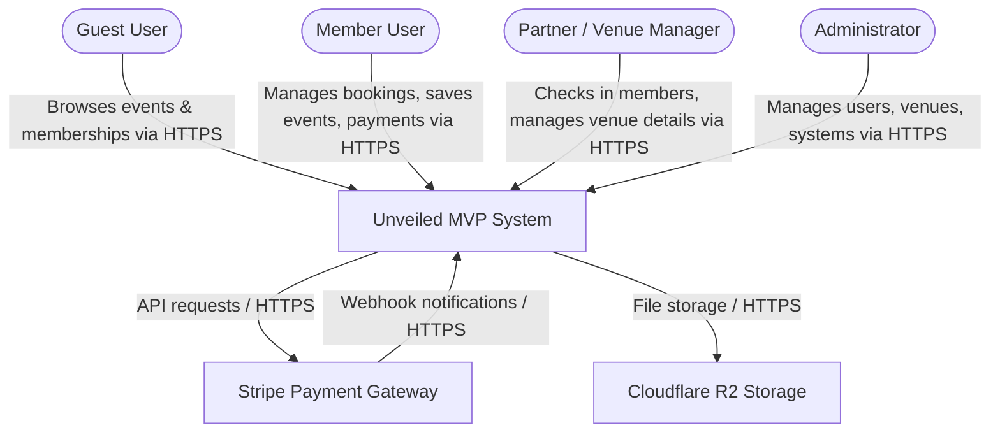
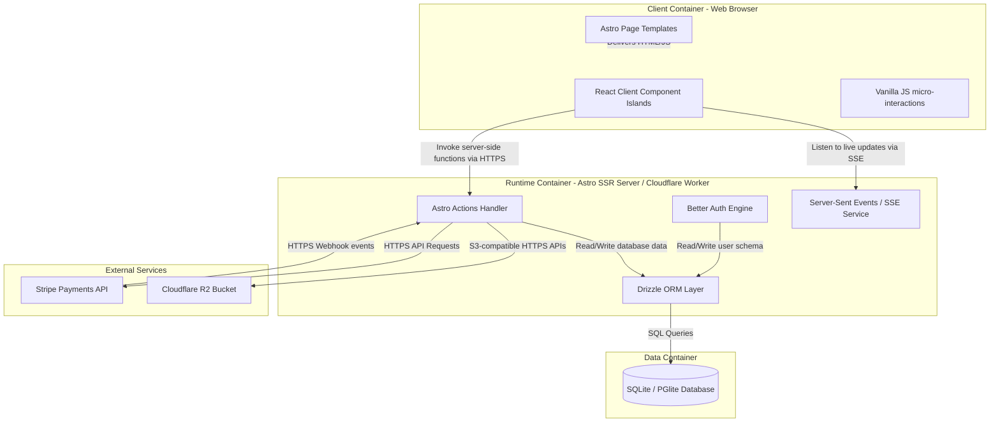

# Unveiled MVP C4 Architecture

This document defines the system context, runtime containers, component organization, and communication protocols for the Unveiled MVP platform.

---

## 1. System Context (L1)

The System Context diagram shows the boundaries of the Unveiled MVP system and its interactions with users and external services.

### Context Components & Boundaries

| Actor / System | Description | Trust Boundary / Protocol |
| :--- | :--- | :--- |
| **Guest User** | Unauthenticated viewer browsing public discovery, FAQ, and membership landing pages. | Untrusted, HTTPS |
| **Member User** | Authenticated subscriber booking cultural access events, checking credits, saving events. | Authentrusted User Session, HTTPS |
| **Partner / Venue** | Authenticated partner check-in agent registering event arrivals at venues. | Authentrusted Partner Session, HTTPS |
| **Admin** | Superuser overseeing users, venues, global credits, and system operational configs. | Authentrusted Admin Session, HTTPS |
| **Unveiled MVP** | Core Astro SSR Application and associated state layers. | Core System |
| **Stripe** | External billing processor handling subscriptions, checkout charges, and billing portals. | External Trusted API, HTTPS / Webhooks |
| **Cloudflare R2** | Cloud object storage bucket used for hosting event/venue images and uploads. | External Trusted API, HTTPS |

---

## 2. Container Architecture (L2)

The Container level diagram breaks down the runtime environments within the Unveiled MVP system.

### Container Details

* **Client Container (Web Browser)**:
  * **Astro Page Templates**: Statically or server-rendered templates forming the structural UI.
  * **React Client Component Islands**: Selected dynamic views (e.g. Booking modal interactive flows, filter components) hydrated on the client.
  * **Vanilla JS**: Quick browser-native styles and navigation drawer transitions.
* **Server Container (Astro SSR Server / Cloudflare Worker)**:
  * Runs the Astro Server middleware and endpoint routing. Runs on Cloudflare Workers/Pages in production.
  * **Better Auth Engine**: Handles user sessions, registration, and role verification (User, Admin, Partner).
  * **Astro Actions**: Structured endpoint functions for type-safe client-server mutations.
  * **SSE Endpoint**: Server-Sent Events stream for push updates (e.g., live venue check-in notifications).
  * **Drizzle ORM**: Maps database queries to type-safe TypeScript interfaces.
* **Data Container**:
  * **SQLite / PGlite**: Relational data store. PGlite runs locally in memory/disk (`./.data/pglite`), while production uses a managed Postgres instances. Both use standard Drizzle integrations.

---

## 3. Communication Protocols

All component communication boundaries follow strict interface protocols:

1. **HTTPS / REST Actions**:
   * Client-to-Server interactions utilize type-safe **Astro Actions** over POST requests.
   * Responses return JSON with standard status codes.
2. **Server-Sent Events (SSE)**:
   * Real-time notifications (such as live check-ins) use standard `text/event-stream` connections.
   * The client initiates an SSE channel; the server streams JSON messages to keep client state synchronized without polling.
3. **Webhooks**:
   * Stripe triggers asynchronous events (e.g. `customer.subscription.updated`) directed to `/api/webhooks/stripe`.
   * These webhooks must be verified using Stripe's signing secret and processed idempotently.
